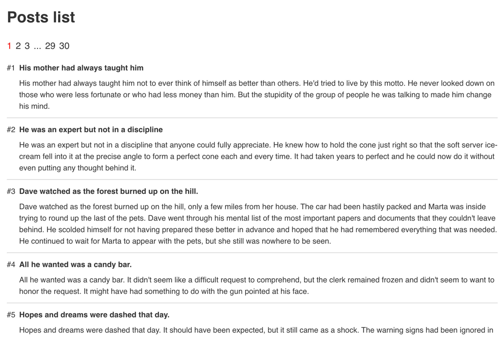

# Rolos challenge

This is the simple SPA application repo that lists some posts.\
Posts are loaded from https://dummyjson.com

## Task overview

Your task is to improve the application.\
Application is written using Vue 3 framework

You need to add a pagination functionality to the application.\
Pagination should work like pagination on [GitHub](https://github.com/search?q=test&type=Repositories) or [habr](https://habr.com/en/all/).

Here is the video of how it could work:
[](info/recording.mp4)

Please, don't use solutions from the internet.\
It's not forbidden to do further improvements to the application if you want to.

## Steps

1. Copy/fork this project on GitHub
2. Add the pagination functionality
3. Commit your solution and send the link to the repo to HR

## Development

To install the dependencies use the command
```shell
npm install
```

To run the dev server use the command
```shell
npm run dev
```

## Hints

Please, think about these questions. We will cover them during the interview:
1. Is there something in the application that looks bad or maybe something that would be great to improve?
2. How can we improve this project to get a better developer experience?
3. What browser is doing to show this application? i.e. what's happening under the hood when we start the dev server and open the application in the browser?
